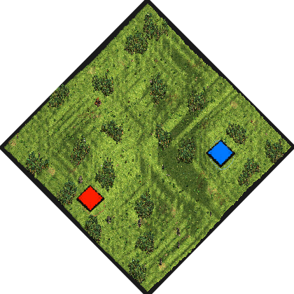
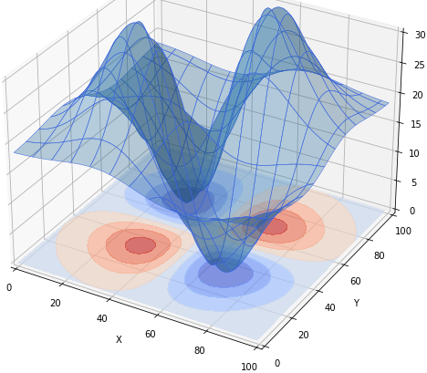

# 3D Plot
by ArthurXIV

### Map icon

Put this .png in the following folder if you want it displayed ingame in the map selection screen:  
C:\Program Files (x86)\Steam\steamapps\common\AoE2DE\resources\_common\random-map-scripts

### Targeted result for elevation

### Map features
- The idea was to have Arabia but with elevation z=xy*exp(-x²-y²). I did code the elevation correctly but dislike the end result, so i won't finish this map.

### Introduction
-