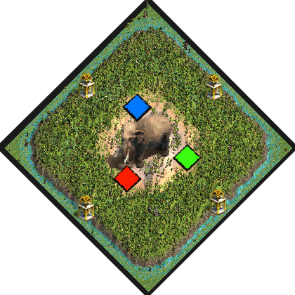

# Hunt Rush
by ArthurXIV

### Map icon

Rename this .png to fit the played map name and put it in the following folder if you want it displayed ingame in the map selection screen:   
C:\Program Files (x86)\Steam\steamapps\common\AoE2DE\resources\_common\random-map-scripts

### Map features
- Circular map:

>Center: &nbsp; &nbsp; &nbsp; 4 Relics, lots of Elephants on Beach terrain. Walls only.  
>1st ring: &nbsp; &nbsp; &nbsp; still Beach terrain.  
>2nd ring: &nbsp; &nbsp; &nbsp; Players. Very high proximity. Cramped space for buildings.  
>3rd ring: &nbsp; &nbsp; &nbsp; messy Rainforest.  
>4th ring: &nbsp; &nbsp; &nbsp; Relics, Crocodiles and few fish on Shallow terrain. Allows naval Trade.  

- expensive towers (+76 stone)

- Starter:

> 3 villagers (can be set to 9, just deactivate the comment)  
> Scout  
> Merchant  
> Donkey (can trade)  

### Description
This map features a large unconstructible battlefield in the center so that armies cannot easily retreat to a nearby castle or tower.
Make sure to mess with your ennemies while they try to lure elephants from the center.

### Introduction
This strange island located in a swampy area homes a wild variety of fauna and
vestige. Far from the coast, the very dry land is occupied only by a few zebra
and a vast pack of elephants.