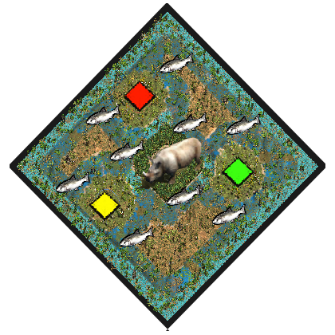

# Rhino Wetlands
by ArthurXIV

### Map icon

Rename this .png to fit the played map name and put it in the following folder if you want it displayed ingame in the map selection screen:  
C:\Program Files (x86)\Steam\steamapps\common\AoE2DE\resources\_common\random-map-scripts

### Map features
- Circular map:

>Center: &nbsp; &nbsp; &nbsp; 4 Relics, lots of Rhinos on Shallow terrain.  
>1st ring: &nbsp; &nbsp; &nbsp; Wood wall.  
>2nd ring: &nbsp; &nbsp; &nbsp; Player islands and neutral islands. Cramped space for buildings.  
>3rd ring: &nbsp; &nbsp; &nbsp; Shallow connection.  
>4th ring: &nbsp; &nbsp; &nbsp; Relics and Crocodiles on Shallow terrain.  

- expensive towers (+76 stone)
- low hp warships (div by 2)

- Starter:

> 3 villagers (can be set to 9, just deactivate the comment)  
> Scout  
> Merchant  
> Donkey (can trade)  
> Junk (can trade)  
> Trade Cog  
> Transport Ship  
> Fishing Ship  

### Description
My intent when building this map was to make thin player islands with all their resources pulled towards the shore, so that warships become a huge threat.
Of course since warships are already overpowered in AOE2 i had to balance that power. That's why their cost is x2.
I also wanted players to be able to sneak base raids using a path around the edges of the map. This probably won't be efficient at all but it's feasible.

### Introduction
This archipelago is centered around an island covered with a dense forest. Adventurers who managed to penetrate this forest distinctly remember facing a throng of rhinos and fleeing by boat immediately.