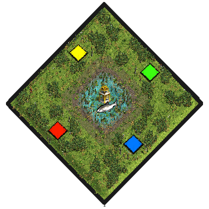

# Units Madness
by ArthurXIV

### Map icon

Put this .png in the following folder if you want it displayed ingame in the map selection screen:  
C:\Program Files (x86)\Steam\steamapps\common\AoE2DE\resources\_common\random-map-scripts

### Map features
- Circular map:

>Center: &nbsp; &nbsp; &nbsp; 4 Relics, lots of Fish on Shallow terrain.  
>1st ring: &nbsp; &nbsp; &nbsp; Resources on Mangrove.  
>2nd ring: &nbsp; &nbsp; &nbsp; Empty Wetrockbeach. 
>3rd ring: &nbsp; &nbsp; &nbsp; Player lands with woodlines.  
>4th ring: &nbsp; &nbsp; &nbsp; Thin gap on map edges allowing uniots to walk behind woodlines.

- Tons of special units available to train in various buildings.  
- Fire Towers are buildable.  

- Starter:

> 3 villagers (can be set to 9, just deactivate the comment)  
> Scout  
> Merchant  

### Introduction
For it is said this small patch of swamp always provides its visitors with plenty succulent fish and marvelous relics, Lords from all over the country have been fighting over it for decades.